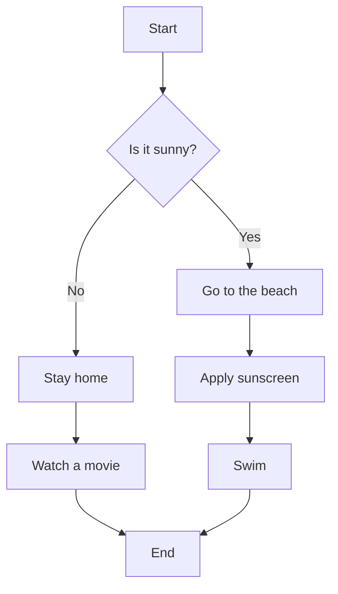
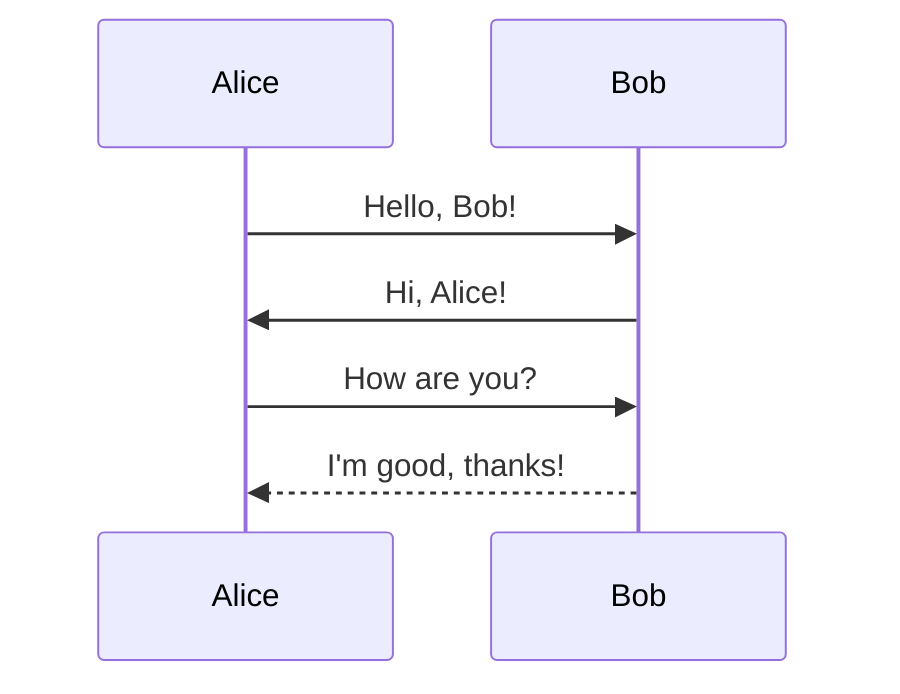

# Template blog post

As robotics continues to advance at a rapid pace, so too do the ethical questions surrounding its development. The creation of intelligent machines capable of complex tasks raises profound concerns about safety, privacy, and the potential impact on employment. In this article, we will explore these ethical dilemmas and discuss the implications for the future of robotics.

## Text Formatting

You can make text **bold**, _italic_, or **_both_**. For inline code, use `backticks`. ~~Strikethrough~~ is also available.

## Lists

### Unordered List

- Item 1
- Item 2
  - Subitem A
  - Subitem B
- Item 3

### Ordered List

1. First
2. Second
   1. Subsection
   2. Another subsection
3. Third

### Task List

- [x] Completed task
- [ ] Pending task
- [x] Another completed task

## Blockquotes

> This is a blockquote.
>
> > Nested blockquotes are also possible.

## Code Blocks

```python
def greet(name):
    print(f"Hello, {name}!")

greet("Ekumen")
```

## Horizontal Rule

---

## Links

[Beluga's repo](https://github.com/Ekumen-OS/beluga) | [Beluga documentation](https://ekumen-os.github.io/beluga)

## Tables

| Feature       | CommonMark | GitHub Flavored |
| ------------- | :--------: | :-------------: |
| Tables        |     ❌     |       ✅        |
| Strikethrough |     ❌     |       ✅        |
| Autolinks     |     ✅     |       ✅        |

## Admonitions

>[!note]
> This is a note admonition. It's commonly used for additional information.

>[!warning]
>Be cautious! This is a warning admonition.

>[!tip]
>Here's a helpful tip using the tip admonition.

>[!important]
>This is an important admonition.

>[!caution]
>This is a caution admonition.


## Math Notation

Inline math: The quadratic formula is $x = \frac{-b \pm \sqrt{b^2 - 4ac}}{2a}$.

Display math:

$$
\begin{aligned}
\nabla \times \vec{\mathbf{B}} &= \mu_0\vec{\mathbf{J}} \\
\nabla \cdot \vec{\mathbf{E}} &= \frac{\rho}{\epsilon_0}
\end{aligned}
$$

## Mermaid Diagrams

### Flowchart



### Sequence Diagram



## Images, Figures, and GIFs

### Basic Image


### Figure with Caption

<figure>
    
    <figcaption>Figure 1: Andino robot</figcaption>
</figure>

### Animated GIF


## Additional CommonMark Features

### Auto-links

https://github.com/Ekumen-OS/andino automatically becomes a link.

### Hard Line Breaks

First line
Second line (two spaces at the end of the first line)

### Soft Line Breaks

This is a paragraph
with a soft line break.

### Escaping Characters

\*Not italic\* \~\~Not strikethrough\~\~ \`Not code\`

### Reference-Style Links

Visit [Ekumen][1] for more info.

[1]: https://www.ekumenlabs.com

### YouTube Video Embed

To embed a YouTube video, you can use an iframe:

<iframe width="560" height="315" src="https://www.youtube.com/embed/vA-DcBFuLq0?si=f7vvrJ1WgiwyXHPW" title="YouTube video player" frameborder="0" allow="accelerometer; autoplay; clipboard-write; encrypted-media; gyroscope; picture-in-picture; web-share" referrerpolicy="strict-origin-when-cross-origin" allowfullscreen></iframe>

This template now includes all the requested features:

1. CommonMark syntax (headers, lists, code blocks, etc.)
2. Tables
3. Admonitions (note, warning, tip)
4. Math notation (inline and display)
5. Mermaid diagrams (flowchart and sequence diagram)
6. Images (basic)
7. Figures (images with captions)
8. GIFs (animated)
9. YouTube video embed (using `<iframe>`)

Note:

- Some features like admonitions, math notation, and Mermaid diagrams are extensions to CommonMark and may require specific Markdown processors or additional plugins to render correctly.
- For YouTube videos, the iframe method is commonly used, but it's technically HTML, not Markdown.
